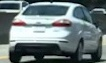
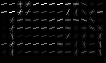
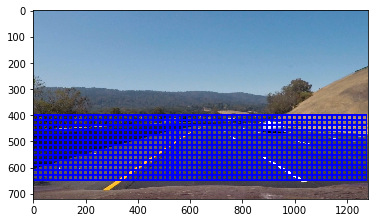
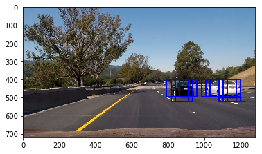
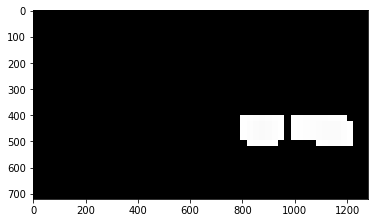
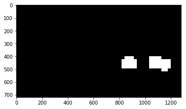

**Vehicle Detection Project**

The goals / steps of this project are the following:

* Perform a Histogram of Oriented Gradients (HOG) feature extraction on a labeled training set of images and train a classifier Linear SVM classifier
* Optionally, you can also apply a color transform and append binned color features, as well as histograms of color, to your HOG feature vector. 
* Note: for those first two steps don't forget to normalize your features and randomize a selection for training and testing.
* Implement a sliding-window technique and use your trained classifier to search for vehicles in images.
* Run your pipeline on a video stream (start with the test_video.mp4 and later implement on full project_video.mp4) and create a heat map of recurring detections frame by frame to reject outliers and follow detected vehicles.
* Estimate a bounding box for vehicles detected.

## [Rubric](https://review.udacity.com/#!/rubrics/513/view) Points
### Here I will consider the rubric points individually and describe how I addressed each point in my implementation.  

### Code Organization 

| File                                | Description                                                                        
| ----------------------------------- | --------------------------------------------------------------------------|
|`/Exercises/MainCode.ipynb`      | Code demonstrating steps of complete image processing pipeline |
|`/Exercises/VehicleTracker2.py`  | Top-level class which tracks Vehicle |
|`/Exercises/car_classifier.py`  | Class which trains classifier or pre-loads classifier from file, used by detector|
|`/Exercises/HeatMapper.py`       | Class which calculates heatmap using binary images from different scales and previous N frames|
|`/Exercises/lesson_functions.py`  | Code with all the utility functionss defined as part of exercises|
|`/Exercises/Maincode.ipynb`  |ipython notebook used for processing single image and video|

## Procesing Pipeline

#### 1: Build Classifier Part 1: Experiment with features and build feature extractors
#### 2: Build Classifier Part 2: Build, train and test classifier on training & validation data with feature extractors
#### 3: Build Detector Part 1: search function which will scan through the image and identify vehicle in the regions of image
#### 4: Build Detector Part 2: Remove Outliers and multiple boxes

### 1.  Feature Extraction

#### Histogram of Oriented Gradients (HOG)

After experimenting with various features such spatial histogram, color histogram, Histogram of gradients.
I chose a feature vector which is combination of all three features mentioned above using YCbCr color space.

Below are the settings I used for HOG:
* Number of Histogram Bins= 32
* Number of orientations = 9
* Number of pixels per cell =8
* Number of cells per block = 2

| Raw Image |HOG Image|
|---|---|
| |  |

> For definition of color histogram check  <b>`lesson_functions.py >>get_hog_features function`</b> (lines 34-42)

Explain how (and identify where in your code) you extracted HOG features from the training images. Explain how you settled on your final choice of HOG parameters.

Describe how (and identify where in your code) you trained a classifier using your selected HOG features (and color features if you used them).

#### Color  Histogram
We additionally use individual color channel histogram information, breaking it into **32 bins** within **(0, 256) range**. 

> For definition of color histogram check <b>`lesson_functions.py >> color_hist function`</b> (lines 34-42)

> For usage of color histogram in extracting features check <b>`lesson_functions.py >> extract_features function`</b> (line 76)

#### Spatial Histogram
For spatial information we simply resize the image to 32×32 and flatten to a 1-D vector.
> For definition of spatial histogram check <b>`lesson_functions.py >> bin_spatial function`</b> (lines 26-30)

> For usage of color histogram in extracting features check <b>`lesson_functions.py >> extract_features function` </b> (line 72)

### `FeatureExtractor` 
The code for feature extraction which combines all these features can can be found 

* Spatial Histogram Vector Size = 32x32x3 (resized image width x height x number of color channels) = 3072
* Color Histogram Vector Size = 32x3 (Number of histogram bins per each color channel x num of channels) = 96
* HOG Vector Size = 42 x 42 x3 (HOG Image Width x Height x number of color channels) = 5292

Total number of columns for each vector of an image/sample = 3072 + 96 + 5292 = 8460

> For implementation details check <b>`lesson_functions.py >> extract_features function`</b>

## Training classifier for detecting cars

#### Car Classifier
Detecting the image and defining whether it is a car or not is a classical machine learning problem i.e., classification, we chose Linear SVC (`sklearn` implementation), using feature extractor described above. Before training the data, data is scaled using 'Standard Scaler' so that one feature doesn't dominate any other features. Then data is split into training and validation data using `sklearn`'s `train_test_split`. Since training the classifier can be time consuming task, training task is performed once and classifier is stored in python pickle files. When car_classifier class is instantiated, the parameters for the classifier is loaded from python pickle files.

> For implementation details check <b>`car_classifier.py >> car_classifier classs>> train_classifier function`</b>

## Frame segmentation
I use a sliding window approach described in the udacity course which allowed for different scaling, overlap. Different scaling is useful because we can approximate vehicle size we expect in different frame regions, which makes searching a bit easier.I have used scaling of 0.75 and 1.5 for the processing pipeline with different end point. Below we can see picture of sliding windows acroos each image, where sub-image in each box is classified to "car" or "non-car" using Support Vector Classifier trained earlier.

Since frame segments must be of various size, and we eventually need to use 64×64 regions as a classifier input, I decided to simply scale the frame to various sizes and then scan them with a 64×64 window. Image below shows output of searching each window (scale = 1.5), detecting car and plotting it back onto image. It can observed that there are multiple blue surrounding each car. We will discuss in next section as how to merge the boxes surrounding each car to single object box.

> For implementation details check <b>`vehicletracker.py >> VehicleTracker class >> find_cars function` </b>(lines 107-143)

## Merging segmented detections
Using find_Cars we get list of bounding boxes where classifier found regions which were coinciding with features of car. However, we can notice from the image below here. There is large overlap between multiple boxes for single object.
Also, in some images/frames of videos we found spurious detections/outliers.

Inorder to solve the above mentioned problems, we can create a heatmap to detect overlapping regions. 
Also, to reject outliers we look at last N frames (N is chosen as 10) and objects which are consistent in some of the frames. To summarize, since there are multiple detections on different scales and overlapping windows, we need to merge nearby detections. In order to do that we calculate a heatmap of intersecting regions that were classified as containing vehicles. To store last N frame `dequeue` container is used inside HeatMapper class.
After merging heatmaps from multiple scales and multiple frames, we threshold the heatmap. Then we use `label()` function from `scipy.ndimage.measurements` module to detect individual groups of detections, and calculate a bounding rect for each of them. These new bounding boxes are filtered bounding boxes using merge and threshold heatmap technique.

| Raw Heatmap |Thresholded Heatmap|
|---|---|
| |  |

> For implementation details check <b>`HeatMapper.py >> HeatMapper Class >> computeHeatMapN' function`</b> (lines 44-58)

### Video Implementation:
Using the techniques mentioned in above sections, we were able to detect vehicles on the road. The `process` function in VehicleTracker class is used to process images from videos. 

> For summary of pipeline check <b>` VehicleTracker.py >> Vehicle Tracker Class >> process' function`</b>

#### Video Link:
The total pipeline testing and processing of the video is at /Code/MainCode.ipynb The final video of the pipeline implementation can be watched here:
https://youtu.be/OqP4KlKgcnM

### Discussion:

This was a great project experience. Eventhough, the current code works fine for the video under test, it is slow in it's performance. The performance of the code can be optimized lot more as all the features might not be required.Also, more tuning needs to be done so that the pipeline is robust to varying lighting conditions. 
The neat thing I learned here is how car is detected as it's scale changes. We found cars which are father/closer & smaller by scaling up/down the region of search. This gave intuition as why were doing pooling a.k.a scaling in deep learning. I am curious to see how other techniques such as deep learning work here.

I have heard of HOG, SVM  etc., before however it was wonderful experience to code them and get intuition for the techniques in this project.
